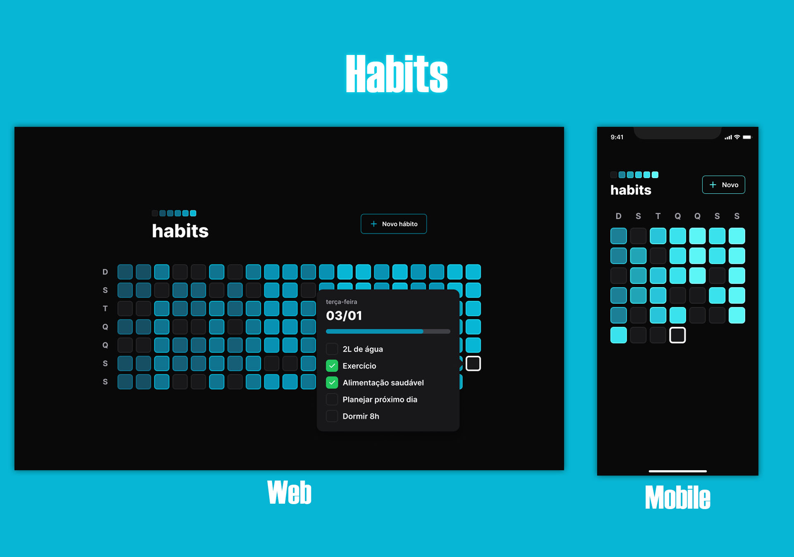

<h1 align="center">Habits</h1>

    

## 🚀 Tecnologias

Esse projeto foi desenvolvido com as seguintes tecnologias:

### **Web**
    - TypeScript
    - React & React DOM
    - Tailwind CSS
    - Radix
    - Dayjs, clsx
    - Axios
    - Git e Github
    - Figma

### **Mobile**
    - TypeScript
    - React Native
    - Expo
    - Nativewind
    - Babel
    - Tailwind CSS
    - Dayjs, clsx
    - Axios
    - Git e Github
    - Figma

### **Back-End**
    - Fastify & Fastify Cors
    - Prisma
    - Dayjs
    - TypeScript
    - Zod

## 💻 Projeto

O Habits é um app para ajudar a desenvolver e acompanhar hábitos.

- [Acesse o projeto finalizado, online](https://gabrielfreitasc.github.io/Habits/)

## 🖼 Layout

Você pode vizualizar o layout do projeto através [DESSE LINK WEB](https://www.figma.com/file/pQwXGCScQDH3UowUlEFlNS/Habits-(i)-(Community)?type=design&node-id=6%3A343&mode=design&t=TGTnuSVgQkQF9qi7-1) e [DESSE LINK MOBILE](https://www.figma.com/file/ss9hSAmpDmcoFdaOvITjda/Habits-(i)-(Community)?type=design&node-id=1%3A2&mode=design&t=EM9DmhXFKx0E0dNq-1). é necessário ter conta no [Figma](https://figma.com) para acessa-lo.

---

Feito com ❤ by Gabriel Freitas - Siga-me no [Linkedin](https://www.linkedin.com/in/gabriel-freitasdev/)
